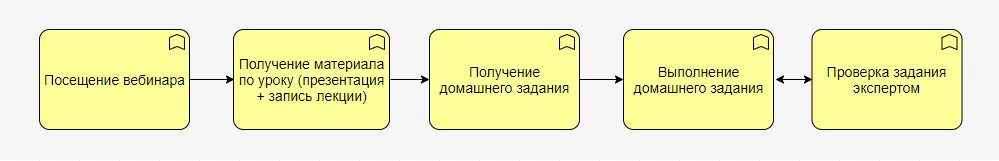
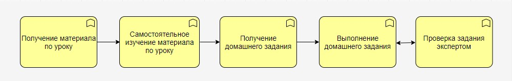

# Переработка курса по JS

## Вводные данные

Текущий процесс обучения на курсе JS

## Вероятный план действий
1. Сокращение программы курса + увеличение объема домашнего задания.
2. Переработка конспектов и презентаций курса
3. Переработка домашниих заданий

## Выходные данные 
Процесс обучения, который хотим получить
 
