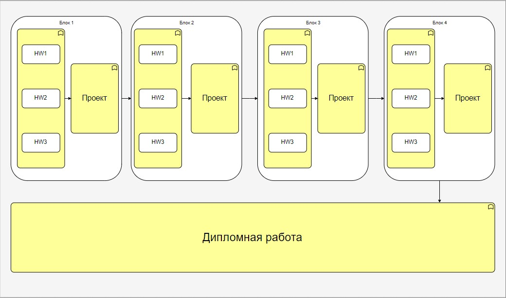

# Переработка курса по JS

## Вводные данные

Текущий процесс обучения на курсе JS

## Вероятный план действий
1. Сокращение программы курса + увеличение объема домашнего задания.
2. Переработка конспектов и презентаций курса
3. Переработка домашниих заданий

## Выходные данные 
Процесс обучения, который хотим получить
 

## Схема прохожения домашних заданий студентов
Теория будет правится исходя из практической работы.  
Для завершения курса, студенту необходимо выполнить 3 домашних задания в каждом блоке курса и проектную работу (объединит в себе все домашние задания по блоку?). Далее студент должен сдать дипломный проект.

